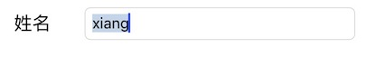
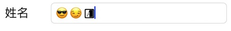
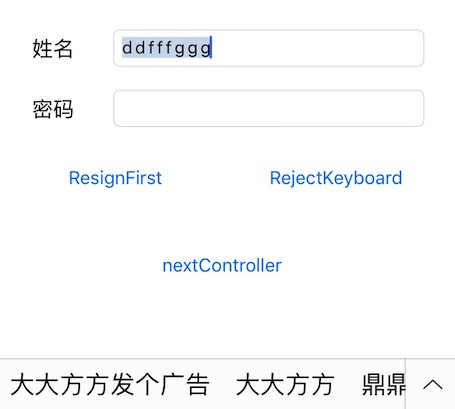
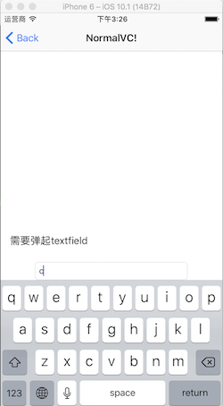
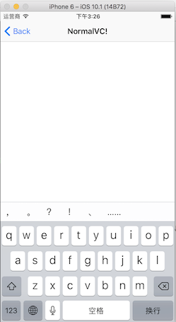

# iOS键盘开发之XXTextfield推荐
`UITextView`,`UITextfield`中如果有keyboard的时候，需要一个自动弹起事件，以及弹起之后的content的偏移对父view的处理。如果每个页面都实现一次会非常复杂。这里我们介绍一种自动化的处理机制。在此之前，先介绍一下文字处理框架

## 一. 字符限制
#### 1. 错误方法
```objc
- (BOOL)textField:(UITextField *)textField shouldChangeCharactersInRange:(NSRange)range replacementString:(NSString *)string
{
    if(range.length + range.location > textField.text.length)
    {
        return NO;
    }
    
    NSUInteger newLength = [textField.text length] + [string length] - range.length;
    return newLength <= 5;
}
```
这种限制方法会导致拼音下出现这种情况，且无法输入.无法输入满5个字符。在emoj表情也有问题
  
   
  

#### 2. 推荐方法
使用rangeOfComposedCharacterSequencesForRange, 防止在range范围内整词被截断  

```objc
- (void)textFieldDidChange:(UITextField *)textField
{
    NSString *toBeString = textField.text;

    UITextRange *selectedRange = [textField markedTextRange];
    UITextPosition *position = [textField positionFromPosition:selectedRange.start offset:0];
    
    // 没有高亮选择的字，则对已输入的文字进行字数统计和限制,防止中文被截断
    if (!position){
        if (toBeString.length > _maxLength){
            //中文和emoj表情存在问题，需要对此进行处理
            NSRange rangeRange = [toBeString rangeOfComposedCharacterSequencesForRange:NSMakeRange(0, _maxLength)];
            textField.text = [toBeString substringWithRange:rangeRange];
        }
    }
}
```   
  

## 二. 放弃键盘
#### 1. 能拿到uitextfield的时候用  

```objc
- (BOOL)textFieldShouldReturn:(UITextField *)textField
{
    return [textField resignFirstResponder];
}
```  

#### 2. 点击view消失的时候用  

```objc
[self.view endEditing:YES];
```  

#### 3. 难以获取的时候用  

```objc  
[[UIApplication sharedApplication] sendAction:@selector(resignFirstResponder) to:nil from:nil forEvent:nil];
```
或者  

```objc
[[[UIApplication sharedApplication] keyWindow] endEditing:YES];
```

#### 2.Tableview点击空白处或者滚动时消失

```objc
{
    UITapGestureRecognizer *singleTap = [[UITapGestureRecognizer alloc] initWithTarget:self action:@selector(fingerTapped:)];
    [self.view addGestureRecognizer:singleTap];
}

#pragma mark- 键盘消失
-(void)fingerTapped:(UITapGestureRecognizer *)gestureRecognizer{
    [self.view endEditing:YES];
}
-(void)scrollViewWillBeginDragging:(UIScrollView *)scrollView{
    [self.view endEditing:YES];
}
```
## 三. 正则表达式限制
请参考[正则表达式语法表](http://www.php100.com/manual/Javascript/html/jsgrpRegExpSyntax.htm),这里我提供了两种表达式给大家参考，一个Int,一个无unsignedInt  

```objc
-(BOOL) isTextFieldMatchWithRegularExpression:(NSString *)exporession{
    
    NSPredicate *predicate = [NSPredicate predicateWithFormat:@"SELF MATCHES %@",exporession];
    return [predicate evaluateWithObject:self];
}
-(BOOL) isTextFieldIntValue{
    return [self isTextFieldMatchWithRegularExpression:@"[-]{0,1}[0-9]*"];
}
-(BOOL) isTextFieldUnsignedIntValue{
    return [self isTextFieldMatchWithRegularExpression:@"[0-9]+"];
}
```

## 四. UITextfield的键盘事件多次回调问题
#### 1.键盘高度遮挡问题
一般出现遮挡的时候我们用以下代码,看看当前textfield是否在键盘下面，在的话算出键盘的顶端和textfield的底部的距离，然后做偏移动画  

```objc
- (void)keyboardWillShow:(NSNotification *)notification {
    
    NSDictionary *userInfo = [notification userInfo];
    
    NSValue* aValue = [userInfo objectForKey:UIKeyboardFrameEndUserInfoKey];
    CGRect keyboardRect = [aValue CGRectValue];
    keyboardRect = [self.view convertRect:keyboardRect fromView:nil];
    
    CGFloat keyboardTop = keyboardRect.origin.y;
    
    CGFloat offset = self.normalTextField.frame.size.height + self.normalTextField.frame.origin.y - keyboardTop;
    
    NSValue *animationDurationValue = [userInfo objectForKey:UIKeyboardAnimationDurationUserInfoKey];
    NSTimeInterval animationDuration;
    [animationDurationValue getValue:&animationDuration];
    
    if(offset > 0){
        // Animate the resize of the text view's frame in sync with the keyboard's appearance.
        [UIView beginAnimations:nil context:NULL];
        [UIView setAnimationDuration:animationDuration];

        CGRect rect = CGRectMake(0.0f, -offset,self.view.frame.size.width,self.view.frame.size.height);
        self.view.frame = rect;
        [UIView commitAnimations];
    }
}
``` 

1. 真机
如果使用了中文输入法，注册的keyboardWillShow会回调两次。第一次是键盘默认高度216，第二次则是加了keyboard的导航栏的高度。  

2. 模拟器  
第一次弹出键盘没有问题   

  

打印userinfo:  

```objc
(lldb) po userInfo
{
    UIKeyboardAnimationCurveUserInfoKey = 7;
    UIKeyboardAnimationDurationUserInfoKey = "0.25";
    UIKeyboardBoundsUserInfoKey = "NSRect: {{0, 0}, {414, 226}}";
    UIKeyboardCenterBeginUserInfoKey = "NSPoint: {207, 849}";
    UIKeyboardCenterEndUserInfoKey = "NSPoint: {207, 623}";
    UIKeyboardFrameBeginUserInfoKey = "NSRect: {{0, 736}, {414, 226}}";
    UIKeyboardFrameEndUserInfoKey = "NSRect: {{0, 510}, {414, 226}}";
    UIKeyboardIsLocalUserInfoKey = 1;
}
```  
此时我们去按123旁边的小圆球会出现如下的图：  

  
打印userinfo:  

```objc
(lldb) po userInfo
{
    UIKeyboardAnimationCurveUserInfoKey = 7;
    UIKeyboardAnimationDurationUserInfoKey = "0.25";
    UIKeyboardBoundsUserInfoKey = "NSRect: {{0, 0}, {414, 271}}";
    UIKeyboardCenterBeginUserInfoKey = "NSPoint: {207, 623}";
    UIKeyboardCenterEndUserInfoKey = "NSPoint: {207, 600.5}";
    UIKeyboardFrameBeginUserInfoKey = "NSRect: {{0, 510}, {414, 226}}";
    UIKeyboardFrameEndUserInfoKey = "NSRect: {{0, 465}, {414, 271}}";
    UIKeyboardIsLocalUserInfoKey = 1;
}
```
键盘被遮挡了。

总结:观察结果,发现了这个规律，打印一下时间,还有一个问题就是，中文键盘第一次启动的时候会回调两次。  

```objc
    keyboardRect = [self.view convertRect:keyboardRect fromView:nil];
```
所以去掉这句话即可  

## 五. 使用封装的XXTextField
最后给大家推荐一下我写的`XXTextField`,大家也可以在此基础上自己添加一些正则表达式。使用方法很简单.欢迎加入QQ群：237305299 ，一起探讨iOS技术问题  

#### 1.解决uiview中的textfield 遮挡问题

```objc
_textfieldName.keyboardType = UIKeyboardTypeDefault;
_textfieldName.inputType = XXTextFieldTypeOnlyInt;
_textfieldName.maxLength = 5;
_textfieldPwd.inputType = XXTextFieldTypeForbidEmoj;

#import "XXKeyboardManager.h"
@interface XXCorrectVC ()<XXKeyboardManagerShowHiddenNotificationDelegate>
@end

@implementation XXCorrectVC

- (void)viewDidLoad {
    [super viewDidLoad];
    [[XXKeyboardManager sharedInstance] setDelegate:self];
    // Do any additional setup after loading the view from its nib.
}
#pragma mark- KeyBoardShow/Hidden
- (void)showKeyboardWithRect:(CGRect)keyboardRect
                withDuration:(CGFloat)animationDuration
{
    CGFloat offset = self.textFieldCorrect.frame.size.height + self.textFieldCorrect.frame.origin.y - keyboardRect.origin.y;
    if(offset < 0){
        return;
    }
    [UIView animateWithDuration:animationDuration
                          delay:0.f
                        options:UIViewAnimationOptionCurveEaseInOut animations:^{
        CGRect rect = CGRectMake(0.0f, -offset,self.view.frame.size.width,self.view.frame.size.height);
        self.view.frame = rect;
    } completion:^(BOOL finished) {
        
    }];
}

- (void)hiddenKeyboardWithRect:(CGRect)keyboardRect
                  withDuration:(CGFloat)animationDuration
{
    [UIView animateWithDuration:animationDuration
                          delay:0.f
                        options:UIViewAnimationOptionCurveEaseInOut animations:^{
        self.textFieldCorrect.frame = self.view.bounds;
    } completion:^(BOOL finished) {
    }];
}
@end
```  
#### 2.解决uitableview中键盘遮挡问题  

```objc
/*
 * 键盘要显示的时候
 */
- (void)showKeyboardWithRect:(CGRect)keyboardRect
                withDuration:(CGFloat)animationDuration{
    
    CGSize kbSize = keyboardRect.size;
    
    UIEdgeInsets contentInsets = UIEdgeInsetsMake(0.0, 0.0, kbSize.height, 0.0);
    _baseTableView.contentInset = contentInsets;
    _baseTableView.scrollIndicatorInsets = contentInsets;
    
    // If active text field is hidden by keyboard, scroll it so it's visible
    // Your app might not need or want this behavior.
    CGRect aRect = self.view.frame;
    aRect.size.height -= kbSize.height;
    
    if (!CGRectContainsPoint(aRect, _activeCell.frame.origin) ) {
        [_baseTableView scrollRectToVisible:_activeCell.frame animated:YES];
    }
}

/*
 * 键盘要消失的时候
 */
- (void)hiddenKeyboardWithRect:(CGRect)keyboardRect
                  withDuration:(CGFloat)animationDuration{
    _baseTableView.contentInset = UIEdgeInsetsZero;
    _baseTableView.scrollIndicatorInsets = UIEdgeInsetsZero;
}
```  

下载地址:[xxtextfield](https://github.com/xcysuccess/XXAll/tree/master/%E9%94%AE%E7%9B%98/XXKeyboardAutoPop)
## 六. 参考链接
1. [iOS中UITextField的字数限制](http://www.jianshu.com/p/2d1c06f2dfa4)
2. [正则表达式语法表](http://www.php100.com/manual/Javascript/html/jsgrpRegExpSyntax.htm)
3. [Emoj过滤](http://stackoverflow.com/questions/25861468/how-to-disable-ios-8-emoji-keyboard)  
4. [UIKeyboardWillShowNotification调用多次的问题](https://xing-ou.github.io/2016/05/03/UIKeyboardWillShowNotification%E8%B0%83%E7%94%A8%E5%A4%9A%E6%AC%A1%E7%9A%84%E9%97%AE%E9%A2%98/)
5. [苹果官方做法](https://developer.apple.com/library/content/documentation/StringsTextFonts/Conceptual/TextAndWebiPhoneOS/KeyboardManagement/KeyboardManagement.html)